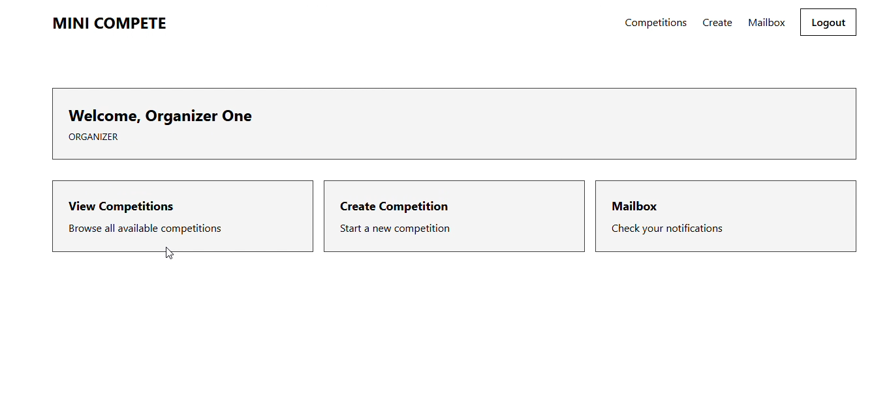
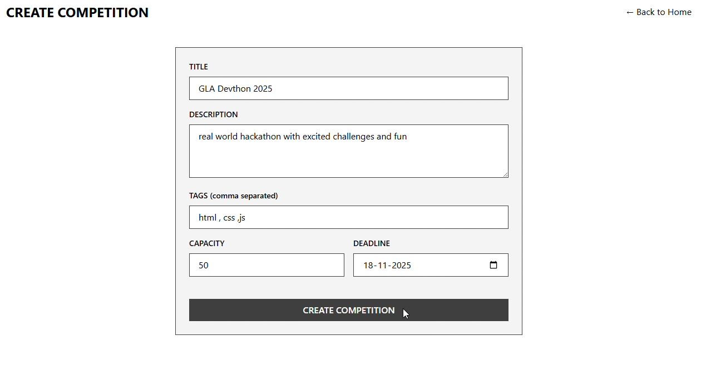
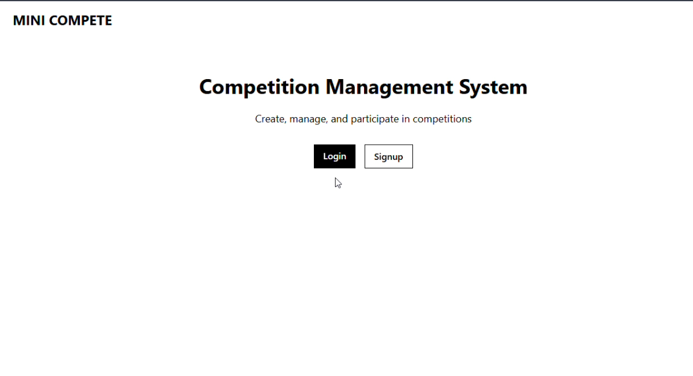
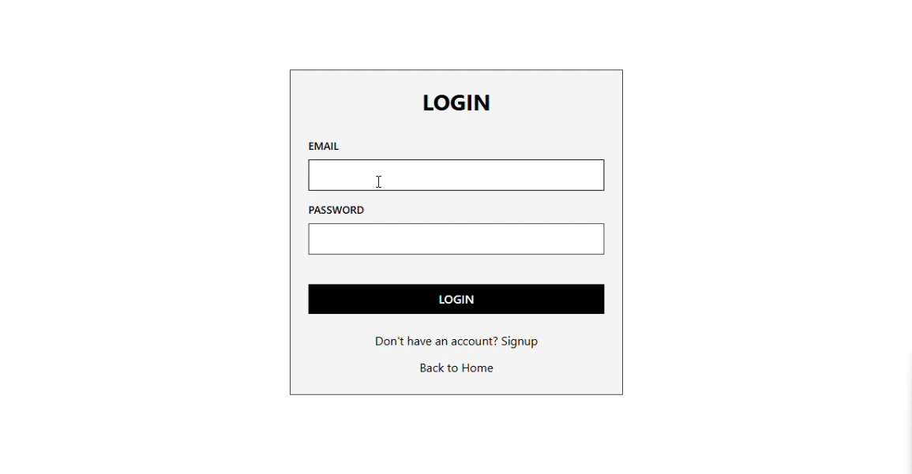
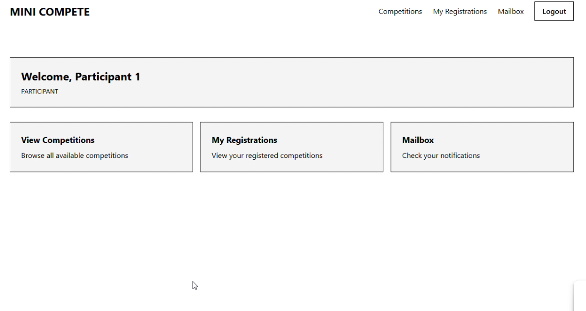
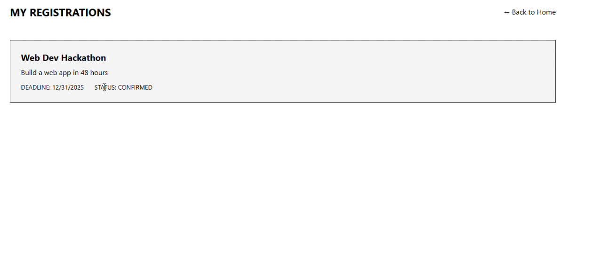

# Mini Compete — Competition Management System

A monorepo system for creating and managing competitions with full authentication, participant registration, concurrency-safe operations, and background job processing.

---

## Overview

Mini Compete is built on a modern full-stack setup:

* **Backend**: NestJS, Prisma ORM, PostgreSQL
* **Frontend**: Next.js (React + Tailwind CSS)
* **Queues & Workers**: BullMQ with Redis
* **Monorepo**: Turborepo

The platform supports organizers, participants, competition creation, safe registrations, email workflows, and scheduled cron reminders.

---

<table>
  <tr>
    <td align="center" style="border:2px solid white; padding:16px;">
      
      <br><b>Preview 1</b>
    </td>
    <td align="center" style="border:2px solid white; padding:16px;">
      
      <br><b>Preview 2</b>
    </td>
  </tr>

  <tr>
    <td align="center" style="border:2px solid white; padding:16px;">
      
      <br><b>Preview 3</b>
    </td>
    <td align="center" style="border:2px solid white; padding:16px;">
      
      <br><b>Preview 4</b>
    </td>
  </tr>

  <tr>
    <td align="center" style="border:2px solid white; padding:16px;">
      
      <br><b>Preview 5</b>
    </td>
    <td align="center" style="border:2px solid white; padding:16px;">
      
      <br><b>Preview 6</b>
    </td>
  </tr>
</table>


---
## Key Features

* JWT-based signup and login
* Organizer-only competition creation
* Participant registration with idempotency
* Safe concurrency using Prisma transactions
* Background workers for email handling
* Scheduled reminder jobs
* Retry logic with DLQ (Dead Letter Queue)

---

## Tech Stack

* **Monorepo**: Turborepo
* **Backend**: NestJS + Prisma + PostgreSQL
* **Frontend**: Next.js + React + Tailwind CSS
* **Queue**: BullMQ + Redis
* **Database**: PostgreSQL

---

## Directory Structure

```
mini-compete/
│
├── apps/                         # Application folder (monorepo)
│   │
│   ├── backend/                  # NestJS API Service
│   │   │
│   │   ├── src/
│   │   │   ├── auth/             # Authentication (signup/login, JWT)
│   │   │   ├── competition/      # Competition creation & registration logic
│   │   │   ├── worker/           # BullMQ workers, queues, cron jobs
│   │   │   ├── prisma/           # Prisma service & database client
│   │   │   └── main.ts           # App entry point
│   │   │
│   │   ├── prisma/               # Prisma schema + migrations
│   │   │   ├── schema.prisma
│   │   │   └── migrations/
│   │   │
│   │   └── package.json
│   │
│   └── frontend/                 # Next.js Web Application
│       ├── app/                  # UI routes (Next.js App Router)
│       ├── components/           # Reusable UI components
│       ├── public/               # Static assets
│       ├── styles/               # Tailwind/global styles
│       └── package.json
│
├── docker-compose.yml            # PostgreSQL + Redis services
├── turbo.json                    # Turborepo config
├── package.json                  # Root dependency file
└── tsconfig.json                 # Root TypeScript config

```

---

## Setup

### 1. Install Dependencies

```bash
cd "c:\Users\as\OneDrive\HTML+\NestJS"
npm install

cd apps\backend
npm install

cd ..\frontend
npm install
cd ..\..
```

### 2. Start Docker (PostgreSQL + Redis)

```bash
docker-compose up -d
```

### 3. Configure Environment

```bash
cd apps\backend
cp .env.example .env
```

Update `.env` if needed.

### 4. Setup Database

```bash
cd apps\backend
npx prisma generate
npx prisma migrate dev --name init
```

### 5. Run Backend

```bash
cd apps\backend
npm run dev
```

Backend runs at: **[http://localhost:3002](http://localhost:3002)**

### 6. Run Frontend

```bash
cd apps/frontend
npm run dev
```

Frontend runs at: **[http://localhost:3000](http://localhost:3000)**

---

## API Endpoints

### Authentication

**POST /api/auth/signup**

```bash
curl -X POST http://localhost:3002/api/auth/signup \
  -H "Content-Type: application/json" \
  -d "{\"name\":\"John\",\"email\":\"john@example.com\",\"password\":\"Pass123\",\"role\":\"participant\"}"
```

**POST /api/auth/login**

```bash
curl -X POST http://localhost:3002/api/auth/login \
  -H "Content-Type: application/json" \
  -d "{\"email\":\"john@example.com\",\"password\":\"Pass123\"}"
```

### Competitions

**GET /api/competitions**

```bash
curl http://localhost:3002/api/competitions
```

**POST /api/competitions** (Organizer only)

```bash
curl -X POST http://localhost:3002/api/competitions \
  -H "Content-Type: application/json" \
  -H "Authorization: Bearer YOUR_TOKEN" \
  -d "{\"title\":\"Hackathon\",\"description\":\"Build something\",\"tags\":[\"tech\"],\"capacity\":100,\"regDeadline\":\"2025-12-31\"}"
```

**POST /api/competitions/:id/register** (Idempotent)

```bash
curl -X POST http://localhost:3002/api/competitions/ID/register \
  -H "Content-Type: application/json" \
  -H "Authorization: Bearer YOUR_TOKEN" \
  -H "idempotency-key: key-123"
```

**GET /api/competitions/my-registrations**

```bash
curl http://localhost:3002/api/competitions/my-registrations \
  -H "Authorization: Bearer YOUR_TOKEN"
```

**GET /api/competitions/mailbox**

```bash
curl http://localhost:3002/api/competitions/mailbox \
  -H "Authorization: Bearer YOUR_TOKEN"
```

---

## Architecture Notes

### Idempotent Registration

* Each register request includes `idempotency-key`.
* The key is stored in the same transaction as the registration.
* Duplicate requests return the existing result, preventing multiple entries.

### Concurrency Handling

Prisma transactions ensure safe seat allocation:

1. Begin transaction
2. Lock competition row
3. Verify available seats
4. Insert registration
5. Decrement seat count atomically
6. Commit

Prevents overselling even under high concurrency.

### Worker and Queue System

* BullMQ queues (Redis) for sending confirmation and reminder emails
* Cron job runs daily to schedule reminders
* Retry with exponential backoff (2 s base)
* Failed jobs stored in DLQ

---

## Postman Collection

A ready-to-import Postman collection is included:

```json
{
  "info": { "name": "Mini Compete API" },
  "item": [...]
}
```

---

## Development Utilities

Stop Docker services:

```bash
docker-compose down
```

View logs:

```bash
docker-compose logs -f
```

Reset database:

```bash
cd apps/backend
npx prisma migrate reset
```


